# Module Flows & Architecture Documentation

This document serves as the **single source of truth** for the Next.js eCommerce theme architecture, providing comprehensive guidance for cloning, extending, and maintaining this application. It includes complete file structures, architectural decisions, development tradeoffs, and implementation patterns to enable LLM agents and developers to recreate or modify this theme for new eCommerce projects.

## Project Overview

This is a production-ready Next.js 15 eCommerce frontend application with atomic design architecture, integrated with Apna Shop APIs through a centralized service layer. The theme is designed to be easily clonable and adaptable for different eCommerce backends.

### Key Features Implemented

- **Authentication**: Login/register with Supabase integration
- **Product Management**: Browse, search, filter products
- **Shopping Cart**: Add/remove/update items with persistence
- **Checkout Flow**: Multi-step checkout with multiple payment gateways
- **Order Management**: View orders, track shipments
- **Wishlist**: Save favorite products
- **API Proxy Layer**: CORS-free third-party API integration
- **Mock/Live Mode**: Switchable testing environments
- **Atomic Design**: Modular, reusable component architecture
- **TypeScript**: Full type safety throughout
- **Responsive Design**: Mobile-first with Tailwind CSS

### Architecture Principles

- **Separation of Concerns**: Clear boundaries between UI, business logic, and data layers
- **Reusability**: Atomic design for component modularity
- **Scalability**: Context-based state management for complex state
- **Maintainability**: Centralized services and consistent patterns
- **Testability**: Mock/live mode switching for reliable testing
- **Performance**: Optimized loading, caching, and error handling

## Complete File Structure Index

When cloning this theme into a fresh Next.js project, create the following file structure. This index ensures all necessary files are created with proper organization.

### Root Directory Structure

```
/
├── .env                          # Environment variables (copy from .env.example)
├── .env.local                    # Local environment overrides
├── .gitignore                    # Git ignore patterns
├── eslint.config.mjs             # ESLint configuration
├── jest.config.js                # Jest testing configuration
├── jest.setup.js                 # Jest setup file
├── next-env.d.ts                 # Next.js TypeScript declarations
├── next.config.ts                # Next.js configuration
├── package.json                  # Dependencies and scripts
├── package-lock.json             # Lockfile for exact dependency versions
├── postcss.config.mjs            # PostCSS configuration
├── README.md                     # Project documentation
├── SUPABASE_SETUP.md             # Supabase setup instructions
├── supabase-schema.sql           # Database schema
├── tailwind.confg.ts             # Tailwind CSS configuration
├── tsconfig.json                 # TypeScript configuration
├── tsconfig.tsbuildinfo          # TypeScript build info
├── MOCK_MODE_README.md           # Mock mode documentation
├── test-*.js                     # Testing scripts (4 files)
├── .kilocode/                    # Kilo Code configuration
│   └── rules/
│       └── memory-bank/          # Project knowledge base
├── docs/                         # Documentation
│   └── module-flows.md           # This file
├── public/                       # Static assets
│   ├── favicon.ico
│   ├── *.svg                     # Icons and images
│   └── theme.yml                 # Theme configuration
└── src/                          # Source code (detailed below)
```

### Source Code Structure (`src/`)

#### App Router Pages (`src/app/`)

```
src/app/
├── layout.tsx                    # Root layout
├── page.tsx                      # Home page
├── client-layout.tsx             # Client-side layout wrapper
├── globals.css                   # Global styles
├── favicon.ico                   # Favicon
├── about/page.tsx                # About page
├── accessibility/page.tsx        # Accessibility page
├── account/
│   ├── page.tsx                  # Account dashboard
│   ├── addresses/page.tsx        # Address management
│   ├── orders/
│   │   ├── page.tsx              # Order history
│   │   └── page-old.tsx          # Legacy order page
│   ├── payment-methods/page.tsx  # Payment methods
│   ├── profile/page.tsx          # Profile settings
│   └── settings/page.tsx         # Account settings
├── affiliates/page.tsx           # Affiliates page
├── api/                          # API proxy routes
│   ├── addresses/
│   │   ├── route.ts              # Address CRUD
│   │   └── [id]/route.ts         # Address by ID
│   ├── cart/
│   │   ├── route.ts              # Cart operations
│   │   └── [item_id]/route.ts    # Cart item operations
│   ├── categories/route.ts       # Categories API
│   ├── orders/route.ts           # Orders API
│   ├── payments/
│   │   ├── route.ts              # Payment operations
│   │   ├── create-razorpay-order/route.ts
│   │   ├── paypal/create-order/route.ts
│   │   ├── stripe/create-intent/route.ts
│   │   └── verify/route.ts       # Payment verification
│   ├── products/
│   │   ├── route.ts              # Products API
│   │   └── [slug]/route.ts       # Product by slug
│   └── themes/route.ts           # Theme API
├── careers/page.tsx              # Careers page
├── cart/page.tsx                 # Shopping cart
├── categories/page.tsx           # Categories page
├── checkout/page.tsx             # Checkout page
├── contact/page.tsx              # Contact page
├── cookies/page.tsx              # Cookies policy
├── forgot-password/page.tsx      # Password reset
├── help/page.tsx                 # Help center
├── login/page.tsx                # Login page
├── order-confirmation/page.tsx   # Order confirmation
├── press/page.tsx                # Press page
├── privacy/
│   ├── page.tsx                  # Privacy policy
│   └── do-not-sell/page.tsx      # Do not sell data
├── products/
│   ├── page.tsx                  # Products listing
│   └── [slug]/page.tsx           # Product detail
├── reset-password/page.tsx       # Password reset confirmation
├── returns/page.tsx              # Returns policy
├── shipping/page.tsx             # Shipping info
├── size-guide/page.tsx           # Size guide
├── stores/page.tsx               # Store locator
├── sustainability/page.tsx       # Sustainability page
├── terms/page.tsx                # Terms of service
├── test-supabase/page.tsx        # Supabase testing
├── track-order/page.tsx          # Order tracking
└── wishlist/page.tsx             # Wishlist page
```

#### Components (`src/components/`)

```
src/components/
├── atoms/                        # Basic UI components
│   ├── Button.tsx                # Reusable button
│   ├── Input.tsx                 # Form input
│   └── Typography.tsx            # Text components
├── molecules/                    # Composite components
│   ├── DiscountOffers.tsx        # Discount display
│   ├── HeaderSearchBar.tsx       # Search in header
│   ├── ProductCard.tsx           # Product card
│   ├── SearchBar.tsx             # Search component
│   └── ThemeSwitcher.tsx         # Theme switcher
├── organisms/                    # Complex components
│   ├── Footer.tsx                # Site footer
│   ├── Header.tsx                # Site header
│   └── ProductGrid.tsx           # Product grid
├── templates/                    # Page templates
│   └── ProductDetailTemplate.tsx # Product detail layout
├── ui/                           # Shared UI components
│   ├── Card.tsx                  # Card component
│   ├── ErrorBoundary.tsx         # Error boundary
│   └── Modal.tsx                 # Modal dialog
├── auth/                         # Authentication components
│   ├── AuthButton.tsx            # Auth action button
│   ├── AuthProvider.tsx          # Auth context provider
│   ├── LogoutButton.tsx          # Logout button
│   ├── ProtectedRoute.tsx        # Route protection
│   └── SupabaseAuthProvider.tsx  # Supabase auth
└── checkout/                     # Checkout components
    ├── CheckoutSidebar.tsx       # Checkout sidebar
    ├── index.ts                  # Exports
    ├── PaymentStep.tsx           # Payment step
    ├── PayPalPayment.tsx         # PayPal integration
    ├── RazorpayPayment.tsx       # Razorpay integration
    ├── ReviewStep.tsx           # Review step
    └── StripePayment.tsx         # Stripe integration
```

#### Contexts (`src/contexts/`)

```
src/contexts/
├── CartContext.tsx               # Shopping cart state
├── CheckoutContext.tsx           # Checkout flow state
├── ProductContext.tsx            # Product data state
├── ThemeContext.tsx              # Theme state
└── WishlistContext.tsx           # Wishlist state
```

#### Hooks (`src/hooks/`)

```
src/hooks/
├── useAuth.ts                    # Authentication hook
├── useCart.ts                    # Cart operations hook
└── useProducts.ts                # Product operations hook
```

#### Library Files (`src/lib/`)

```
src/lib/
├── api.ts                        # Main API service
├── api-orders.ts                 # Order-specific API calls
├── auth-service.ts               # Authentication service
├── mock-data.ts                  # Mock data for testing
├── server-theme-loader.ts        # Server-side theme loading
├── supabase.ts                   # Supabase client
├── theme-loader.ts               # Theme loading utilities
├── third-party-api.ts            # Third-party API utilities
└── types.ts                      # TypeScript definitions
```

#### Legacy Pages (`src/pages/`) - Minimal Usage

```
src/pages/
├── api/
│   └── auth/
│       ├── sync-customer.ts       # Customer sync
│       ├── sync-login.ts          # Login sync
│       └── sync-register.ts       # Register sync
└── auth/
    └── callback.tsx               # Auth callback
```

#### Tests (`src/__tests__/`)

```
src/__tests__/
└── checkout-flow.test.tsx         # Checkout flow tests
```

## Architecture Decisions & Tradeoffs

### 1. Next.js App Router vs Pages Router

**Decision**: Use App Router exclusively for new features, maintain minimal Pages Router for legacy auth callbacks.

**Rationale**:

- App Router provides better performance with server components
- Improved SEO with server-side rendering
- Better code organization with nested layouts
- Future-proof for Next.js evolution

**Tradeoffs**:

- Migration complexity for existing Pages Router code
- Learning curve for new routing patterns
- Some third-party libraries may not support App Router yet

### 2. Atomic Design Component Architecture

**Decision**: Implement strict atomic design hierarchy (Atoms → Molecules → Organisms → Templates).

**Rationale**:

- Promotes component reusability and consistency
- Clear separation of concerns at component level
- Easier testing and maintenance
- Scalable for large applications

**Tradeoffs**:

- Initial overhead in component creation
- Potential over-abstraction for simple components
- Requires discipline to maintain hierarchy

### 3. Context API for State Management

**Decision**: Use React Context API with custom hooks instead of external state libraries.

**Rationale**:

- No additional dependencies for simple state needs
- Built-in React solution with good performance
- Easy integration with server components
- TypeScript support out of the box

**Tradeoffs**:

- Potential re-rendering issues with large context trees
- No built-in persistence (requires manual implementation)
- Less powerful than Redux/Zustand for complex state logic

### 4. API Proxy Layer with Next.js Routes

**Decision**: Proxy all third-party API calls through local `/api/*` routes.

**Rationale**:

- Eliminates CORS issues in production
- Server-side API calls for better security
- Centralized request/response handling
- Easy mocking for testing

**Tradeoffs**:

- Additional network hop for each API call
- Server load increase
- More complex debugging (client ↔ server ↔ external API)

### 5. Mock/Live Mode Switching

**Decision**: Implement environment-based switching between mock and live APIs.

**Rationale**:

- Reliable testing without external dependencies
- Development independence from backend availability
- Easy demonstration and prototyping
- Gradual migration support

**Tradeoffs**:

- Duplicate API contract definitions
- Potential drift between mock and real APIs
- Additional complexity in service layer

### 6. Centralized Service Layer

**Decision**: All API calls go through centralized services (ApiService, AuthService).

**Rationale**:

- Consistent error handling and logging
- Easy to modify API behavior globally
- Better testability with dependency injection
- Clear separation between UI and data layers

**Tradeoffs**:

- Higher abstraction level may hide implementation details
- Potential performance overhead for simple calls
- Requires discipline to avoid bypassing the service layer

### 7. TypeScript Strict Mode

**Decision**: Use strict TypeScript configuration with full type safety.

**Rationale**:

- Catch errors at compile time
- Better IDE support and refactoring
- Self-documenting code with types
- Improved maintainability

**Tradeoffs**:

- Steeper learning curve for JavaScript developers
- More verbose code
- Potential build performance impact

### 8. Tailwind CSS for Styling

**Decision**: Use utility-first Tailwind CSS instead of component libraries.

**Rationale**:

- Consistent design system
- Smaller bundle size (unused styles purged)
- Rapid prototyping and development
- Highly customizable

**Tradeoffs**:

- Inline styles can become verbose
- Learning curve for utility classes
- Less semantic than traditional CSS

### 9. Multiple Payment Gateway Support

**Decision**: Support Razorpay, Stripe, and PayPal simultaneously.

**Rationale**:

- Geographic coverage (different regions prefer different gateways)
- Redundancy and failover capabilities
- Merchant preference flexibility
- Competitive pricing options

**Tradeoffs**:

- Increased complexity in checkout flow
- Multiple integration maintenance
- Higher testing requirements

### 10. Supabase for Authentication

**Decision**: Use Supabase Auth for user management alongside custom API auth.

**Rationale**:

- Robust authentication features (social logins, MFA)
- Real-time capabilities for future features
- Good developer experience
- PostgreSQL integration for user data

**Tradeoffs**:

- Additional service dependency
- Potential vendor lock-in
- Learning curve for Supabase-specific features

## Development Tradeoffs & Best Practices

### Performance Optimizations

- **Server Components**: Use for static content, client components only when needed
- **Image Optimization**: Next.js Image component with proper sizing
- **Code Splitting**: Dynamic imports for route-based splitting
- **Caching**: Multi-layer caching (memory, localStorage, HTTP)

### Error Handling Strategy

- **Error Boundaries**: Component-level error containment
- **Fallback UI**: Graceful degradation for failed features
- **Retry Logic**: Exponential backoff for transient failures
- **User Feedback**: Clear error messages with recovery options

### Testing Approach

- **Mock First**: Develop with mock data, test with live APIs
- **Integration Testing**: End-to-end user flows
- **Component Testing**: Isolated unit tests for components
- **API Testing**: Contract testing for external APIs

### Deployment Strategy

- **Vercel Optimized**: Environment variables, build configs
- **CORS Headers**: Proper CORS configuration for API routes
- **Environment Separation**: Different configs for dev/staging/production

### Scalability Considerations

- **Modular Architecture**: Easy to add new features without affecting existing code
- **Context Splitting**: Break large contexts into focused providers
- **Service Extensions**: Add new API integrations through service layer
- **Component Libraries**: Extract reusable components for other projects

## LLM Instructions for Theme Cloning

This section provides machine-readable instructions for LLM agents to clone and adapt this eCommerce theme.

### Prerequisites for Cloning

- Node.js 18+ and npm
- Fresh Next.js 15 project with App Router
- Target eCommerce backend API documentation
- Payment gateway credentials (optional)

### Step-by-Step Cloning Process

1. **Project Initialization**

   ```
   npx create-next-app@latest my-ecommerce --typescript --tailwind --app
   cd my-ecommerce
   npm install axios js-cookie framer-motion lucide-react react-icons @fortawesome/react-fontawesome
   ```

2. **File Structure Creation**

   - Create all directories listed in "Complete File Structure Index"
   - Copy configuration files (.env, next.config.ts, tailwind.config.ts, etc.)
   - Set up TypeScript configuration

3. **Core Architecture Setup**

   - Implement ApiService with proxy pattern
   - Create Context providers (Auth, Cart, Product, etc.)
   - Set up atomic design component structure
   - Configure mock/live mode switching

4. **API Integration Adaptation**

   - Replace Apna Shop API endpoints with target backend
   - Update request/response types in types.ts
   - Modify API proxy routes to match new backend
   - Update authentication flow if different

5. **Component Implementation**

   - Start with atoms (Button, Input, etc.)
   - Build molecules (ProductCard, SearchBar, etc.)
   - Create organisms (Header, Footer, ProductGrid, etc.)
   - Implement page templates

6. **Feature Implementation Order**

   - Authentication (login/register/profile)
   - Product browsing (list, detail, search)
   - Shopping cart (add/remove/update)
   - Checkout flow (shipping, payment, review)
   - Order management (history, tracking)

7. **Payment Integration**

   - Choose primary payment gateway
   - Implement payment components
   - Set up webhook handling
   - Test payment flows

8. **Testing & Deployment**
   - Set up mock data for development
   - Implement error handling
   - Configure deployment (Vercel recommended)
   - Test all user flows

### Key Adaptation Points

#### Backend API Changes

- Update all API endpoints in `src/lib/api.ts`
- Modify request/response interfaces in `src/lib/types.ts`
- Adjust authentication headers and tokens
- Update API proxy routes in `src/app/api/`

#### Payment Gateway Changes

- Replace payment components in `src/components/checkout/`
- Update payment API routes
- Modify webhook handling
- Adjust payment flow logic

#### Styling Customization

- Update Tailwind configuration
- Modify component styles
- Adjust responsive breakpoints
- Customize color scheme and typography

#### Feature Customization

- Add/remove features based on requirements
- Modify component composition
- Extend context providers
- Add new API integrations

### Common Pitfalls to Avoid

- Direct API calls (always use proxy routes)
- Missing error boundaries
- Improper TypeScript types
- Inconsistent component naming
- Missing loading states
- Poor mobile responsiveness

### Performance Optimization Checklist

- [ ] Implement proper code splitting
- [ ] Use Next.js Image component
- [ ] Enable caching strategies
- [ ] Optimize bundle size
- [ ] Implement lazy loading
- [ ] Add service worker for caching

### Security Checklist

- [ ] Validate all user inputs
- [ ] Sanitize API responses
- [ ] Implement proper CORS headers
- [ ] Use HTTPS in production
- [ ] Secure token storage
- [ ] Rate limiting on API routes

## Authentication Flow

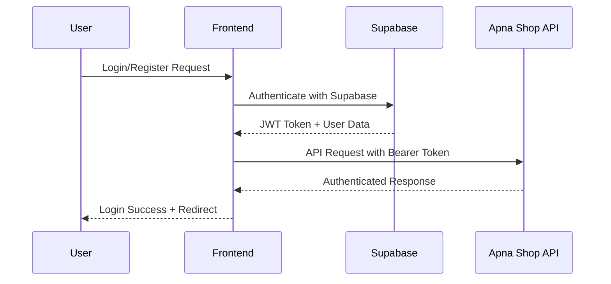

## Cart Management Flow

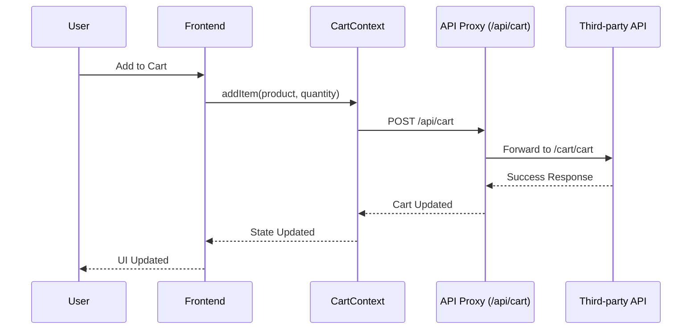

## Wishlist Management Flow

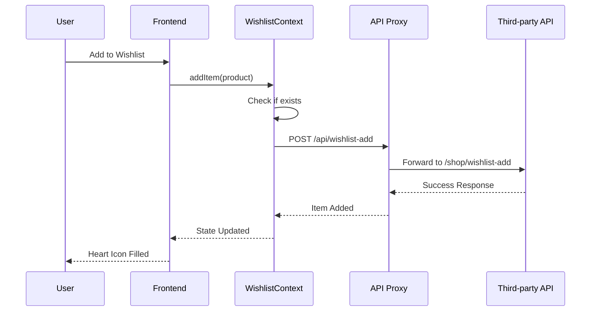

## Checkout Process Flow

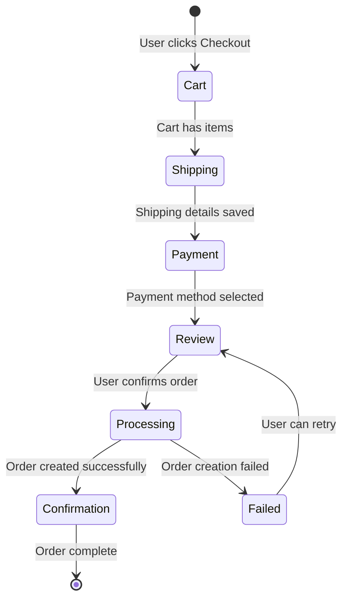

## Payment Integration Flows

### Razorpay Payment Flow

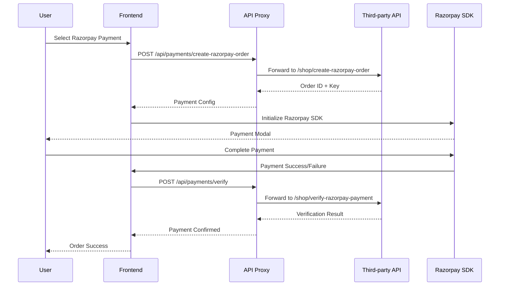

### Stripe Payment Flow

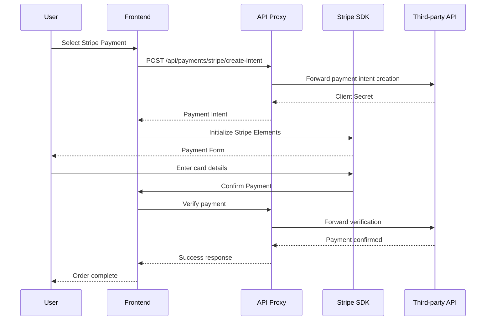

### PayPal Payment Flow

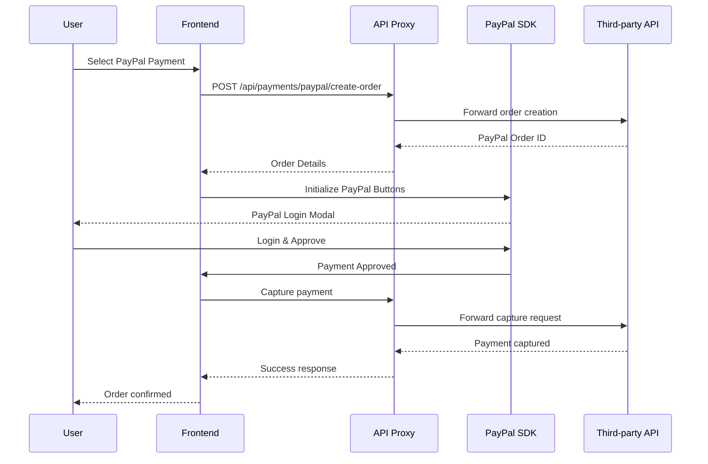

## API Data Flow Architecture

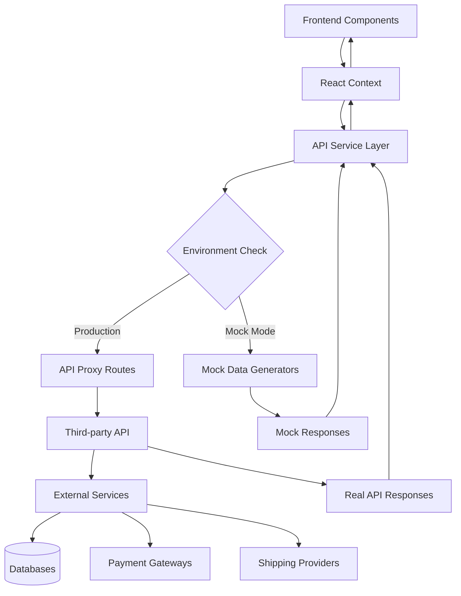

## Order Management Flow

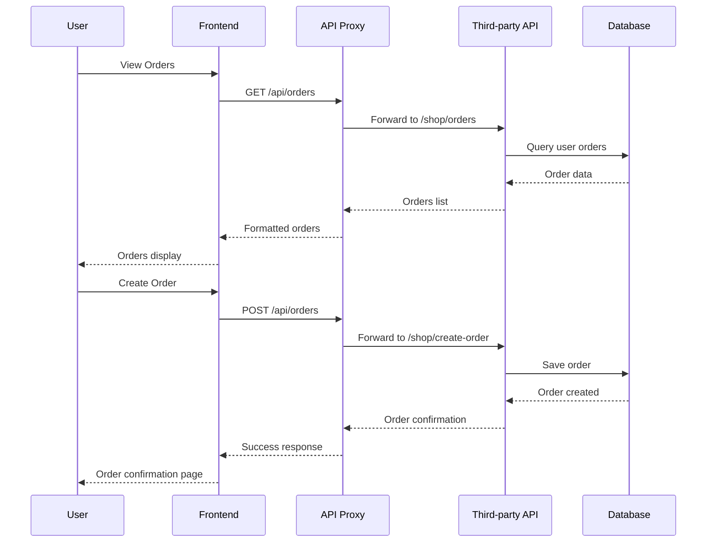

## Product Search and Filtering Flow

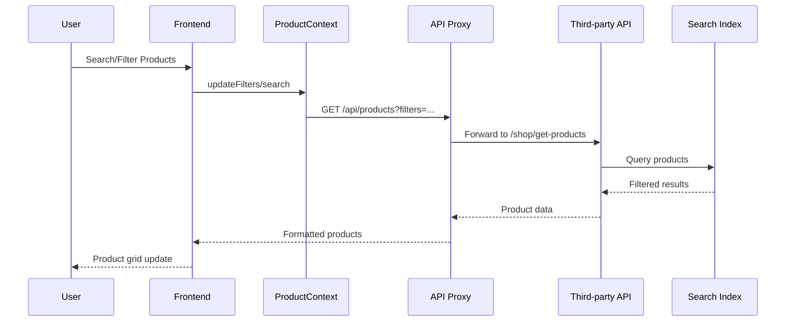

## Error Handling and Fallback Flow

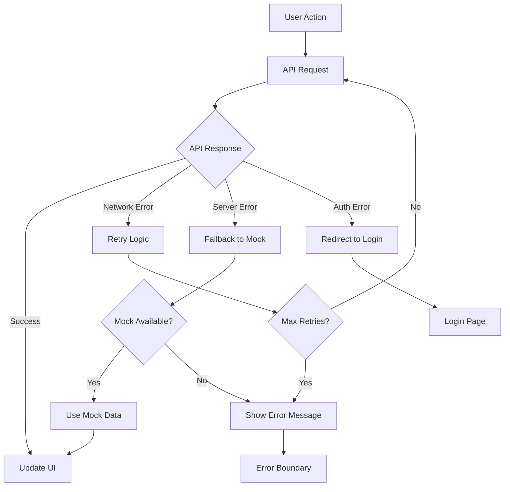

## Third-party Data Storage Integration

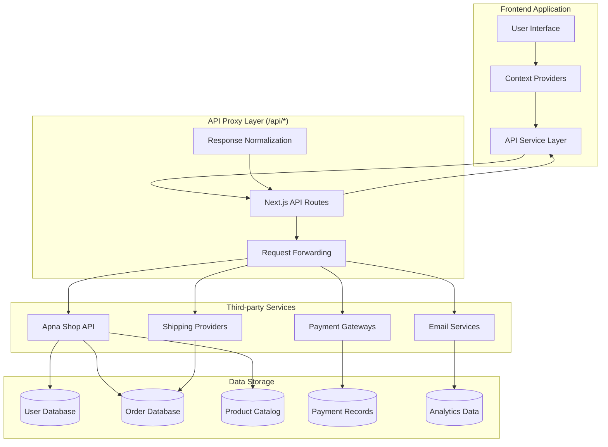

## Performance Monitoring Flow

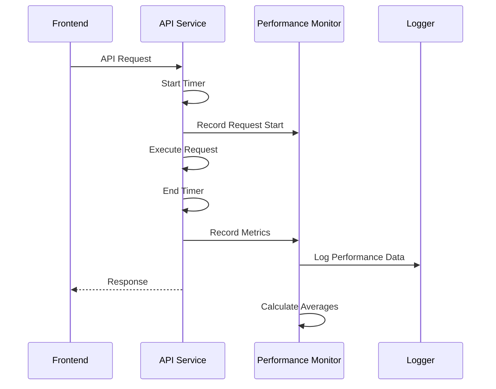

## Security Flow

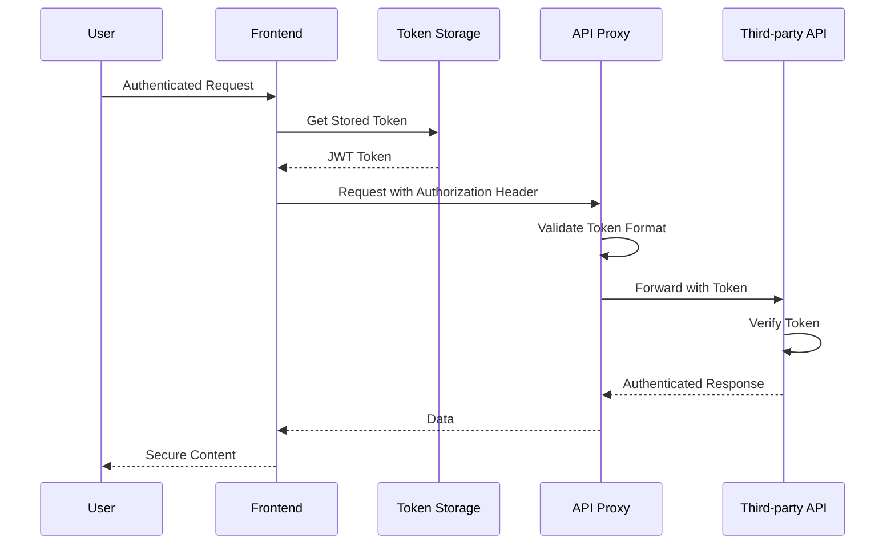

## Caching Strategy Flow

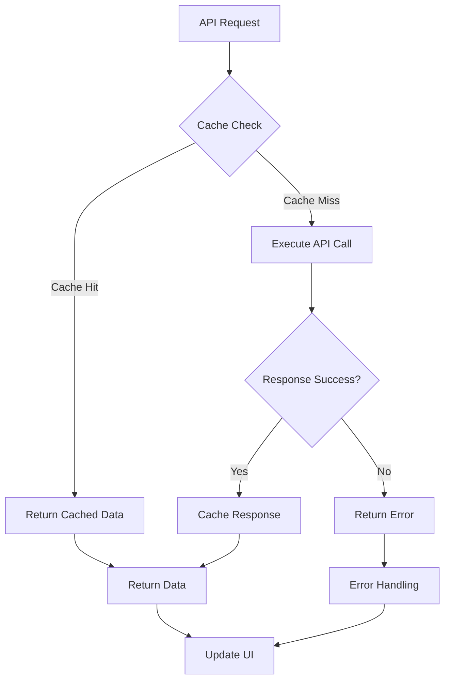

This documentation provides a comprehensive overview of the application's module flows, ensuring developers understand the data flow, error handling, and integration patterns throughout the system.

## Developer Onboarding Guide

### Getting Started

1. **Environment Setup**

   - Clone the repository and install dependencies with `npm install`
   - Copy `.env.example` to `.env` and configure API credentials
   - Run `npm run dev` to start the development server

2. **Understanding the Architecture**

   - Review the atomic design component structure in `src/components/`
   - Familiarize yourself with the service layer in `src/lib/`
   - Study the context providers in `src/contexts/`

3. **Key Concepts**
   - **ApiService**: Centralized API client with caching and monitoring
   - **Context Providers**: State management for auth, cart, products
   - **Atomic Design**: Component hierarchy (atoms → molecules → organisms)
   - **API Proxy**: Local `/api/*` routes proxy third-party API calls

### Development Workflow

1. **Feature Development**

   - Create components following atomic design principles
   - Use existing context providers for state management
   - Add API calls through ApiService methods
   - Test with mock data using `NEXT_PUBLIC_USE_MOCK=true`

2. **Code Organization**
   - Place reusable components in appropriate atomic folders
   - Add custom hooks in `src/hooks/`
   - Extend API services in `src/lib/`
   - Update context providers for new state needs

## Common Pitfalls and Solutions

### API Integration Issues

- **CORS Errors**: Always use local `/api/*` routes instead of direct third-party API calls
- **Authentication Failures**: Ensure `X-Tenant` header is set in API requests
- **Token Expiration**: Implement proper token refresh logic in AuthService

### State Management Problems

- **Context Not Updating**: Use proper dependency arrays in useEffect hooks
- **Race Conditions**: Implement optimistic updates with proper rollback
- **Memory Leaks**: Clean up subscriptions and timeouts in useEffect

### Component Architecture Issues

- **Prop Drilling**: Use context providers instead of passing props deeply
- **Re-rendering Issues**: Memoize expensive computations and callbacks
- **Accessibility**: Always include proper ARIA labels and semantic HTML

### Performance Bottlenecks

- **Large Bundle Size**: Lazy load components and use dynamic imports
- **API Call Frequency**: Implement caching and request deduplication
- **Image Loading**: Use Next.js Image component with proper sizing

## Testing Guidelines

### Unit Testing

- **Component Testing**: Test component rendering and user interactions
- **Hook Testing**: Test custom hooks with React Testing Library
- **Service Testing**: Mock API calls and test service methods
- **Utility Testing**: Test validation and calculation functions

### Integration Testing

- **API Integration**: Test complete API flows with mock responses
- **Context Integration**: Test context providers with real components
- **End-to-End Flows**: Test complete user journeys

### Testing Best Practices

- **Mock Data**: Use comprehensive mock data for consistent testing
- **Test Isolation**: Avoid test interdependencies
- **Accessibility Testing**: Include a11y checks in component tests
- **Performance Testing**: Monitor bundle size and runtime performance

### Test File Organization

```
src/
├── __tests__/                    # Test files
│   ├── components/              # Component tests
│   ├── hooks/                   # Hook tests
│   ├── lib/                     # Service tests
│   └── utils/                   # Utility tests
├── __mocks__/                   # Mock implementations
└── test-utils/                  # Testing utilities
```

## Scalability Considerations

### Performance Optimization

- **Code Splitting**: Use dynamic imports for route-based splitting
- **Image Optimization**: Implement responsive images with WebP format
- **Caching Strategy**: Multi-layer caching (memory, localStorage, HTTP)
- **Bundle Analysis**: Monitor bundle size with webpack-bundle-analyzer

### Architecture Scalability

- **Modular Services**: Keep services focused on single responsibilities
- **Context Splitting**: Split large contexts into smaller, focused providers
- **Component Libraries**: Extract reusable components into separate packages
- **API Rate Limiting**: Implement client-side rate limiting for API calls

### Database and API Considerations

- **Request Batching**: Combine multiple API calls when possible
- **Response Compression**: Enable gzip compression for API responses
- **Pagination**: Implement proper pagination for large datasets
- **Real-time Updates**: Consider WebSocket integration for live data

### Monitoring and Analytics

- **Error Tracking**: Implement error boundaries and logging
- **Performance Monitoring**: Track API response times and user interactions
- **User Analytics**: Monitor user behavior and conversion funnels
- **A/B Testing**: Framework for testing UI/UX variations

## Error Handling Best Practices

### Client-Side Error Handling

- **Network Errors**: Implement retry logic with exponential backoff
- **Validation Errors**: Provide clear, actionable error messages
- **Authentication Errors**: Handle token expiration gracefully
- **Offline Mode**: Provide offline functionality with local storage

### Server-Side Error Handling

- **API Errors**: Normalize error responses across different APIs
- **Timeout Handling**: Implement proper request timeouts
- **Rate Limiting**: Handle API rate limits with backoff strategies
- **Fallback Data**: Provide fallback UI states for failed requests

### Error Recovery

- **Automatic Retry**: Implement smart retry logic for transient failures
- **User Feedback**: Show clear error messages with recovery options
- **Graceful Degradation**: Maintain functionality when non-critical features fail
- **Error Boundaries**: Prevent cascading failures in component trees

## Security Considerations

### Authentication Security

- **Token Storage**: Use HttpOnly cookies for sensitive tokens
- **Session Management**: Implement proper session timeout and renewal
- **CSRF Protection**: Include CSRF tokens in state-changing requests
- **Password Policies**: Enforce strong password requirements

### API Security

- **Request Validation**: Validate all input data on client and server
- **Rate Limiting**: Implement client-side rate limiting
- **HTTPS Only**: Ensure all API calls use HTTPS in production
- **Header Security**: Sanitize and validate request headers

### Data Protection

- **Input Sanitization**: Sanitize user inputs to prevent XSS attacks
- **Data Encryption**: Encrypt sensitive data in local storage
- **Privacy Compliance**: Implement GDPR and privacy regulations
- **Audit Logging**: Log security-relevant events

## Testing Guidelines

### Testing Environment Setup

The application supports two testing modes:

- **Mock Mode** (`NEXT_PUBLIC_USE_MOCK=true`): Uses local mock data for development and testing
- **Live Mode** (`NEXT_PUBLIC_USE_MOCK=false`): Connects to live Apna Shop APIs

### Available Test Scripts

#### For Live API Testing (when server is available):

```bash
# Switch to live mode
echo "NEXT_PUBLIC_USE_MOCK=false" > .env

# Run live API tests
node test-live-api.js
```

#### For Application Component Testing:

```bash
# Run comprehensive component tests
node test-application-components.js

# Test running Next.js application
node test-nextjs-app.js
```

### Test Coverage

- **API Integration**: Tests all Apna Shop APIs endpoints
- **Service Layer**: Validates ApiService and AuthService functionality
- **Context Providers**: Tests CartProvider, ProductProvider, and AuthProvider
- **Component Structure**: Verifies atomic design implementation
- **Error Handling**: Tests fallback mechanisms and error recovery
- **Performance**: Monitors API response times and caching effectiveness

### Testing Best Practices

- **Mock First**: Use mock mode for development and unit testing
- **Integration Testing**: Test complete user flows with live data when available
- **Error Scenarios**: Test network failures, API errors, and edge cases
- **Performance Monitoring**: Track API performance and caching effectiveness
- **Accessibility**: Include a11y testing in component validation

## Deployment and DevOps

### Environment Management

- **Environment Variables**: Use different configs for dev/staging/production
- **Feature Flags**: Implement feature toggles for gradual rollouts
- **Configuration Management**: Centralize configuration in environment files
- **Secret Management**: Securely store API keys and secrets

### CI/CD Pipeline

- **Automated Testing**: Run tests on every push and PR
- **Code Quality**: Implement linting and formatting checks
- **Security Scanning**: Regular security vulnerability scans
- **Performance Monitoring**: Track performance regressions

### Monitoring and Alerting

- **Application Monitoring**: Track application health and errors
- **User Monitoring**: Monitor user experience and satisfaction
- **Business Metrics**: Track conversion rates and user engagement
- **Infrastructure Monitoring**: Monitor server and database performance
