# Module Flows Documentation

This document outlines the key module flows in the eCommerce application, including authentication, cart management, checkout process, payment integrations, and API interactions.

## Authentication Flow

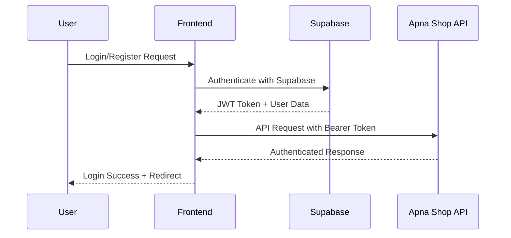

## Cart Management Flow

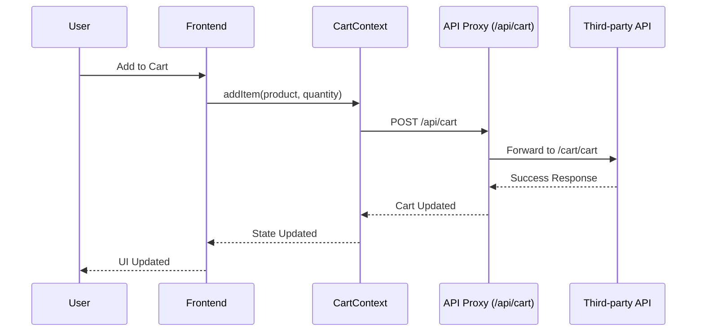

## Wishlist Management Flow

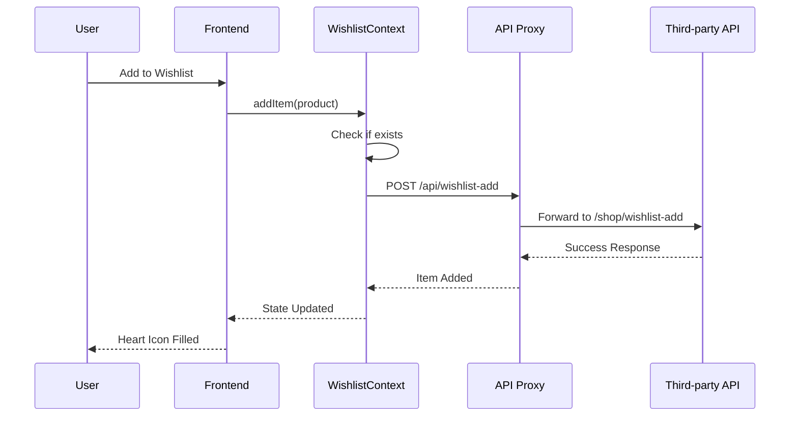

## Checkout Process Flow

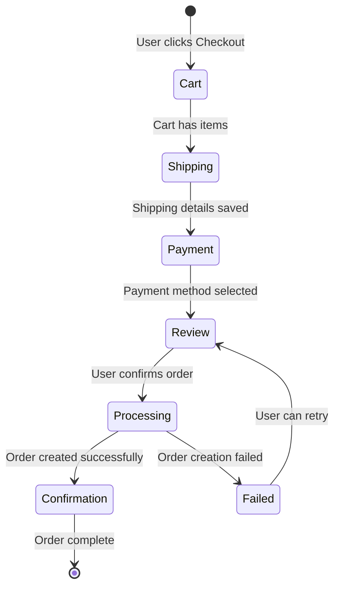

## Payment Integration Flows

### Razorpay Payment Flow

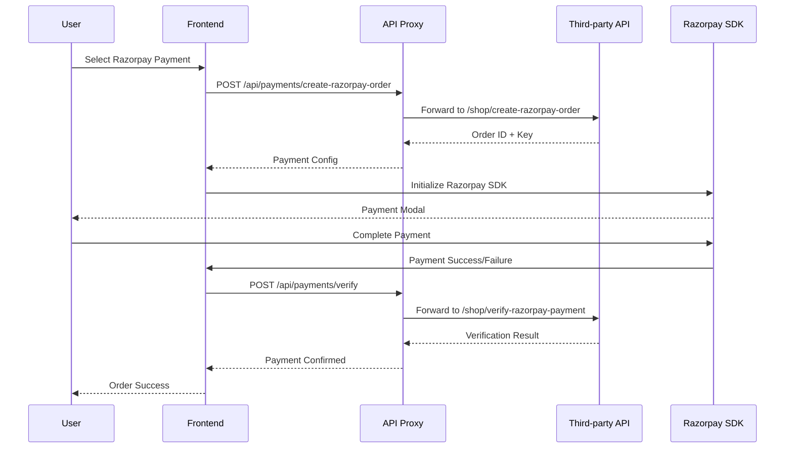

### Stripe Payment Flow

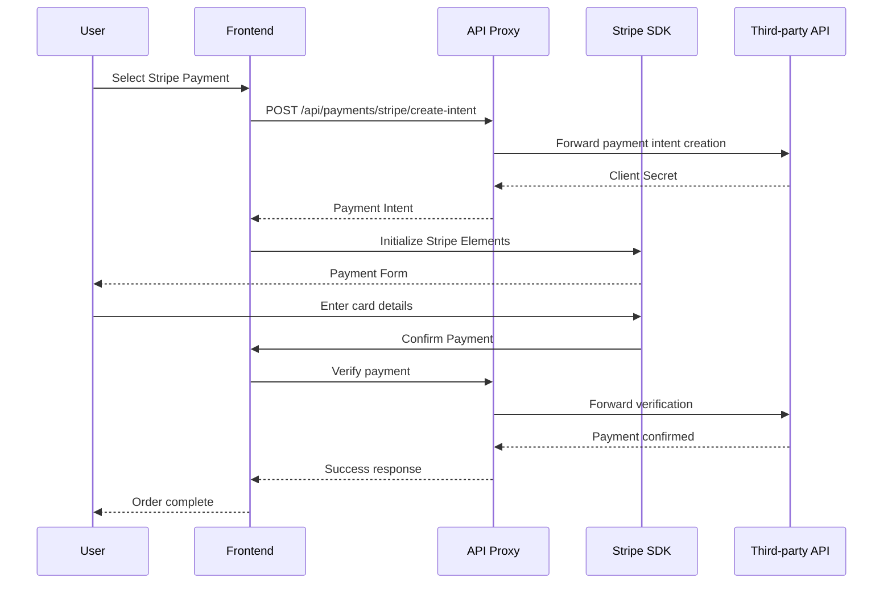

### PayPal Payment Flow

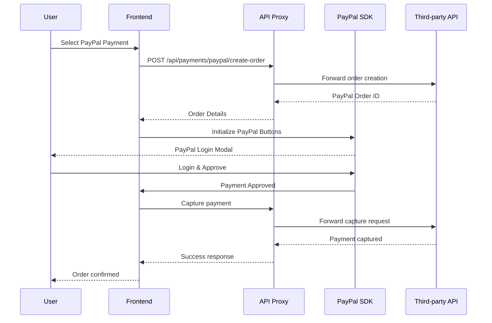

## API Data Flow Architecture

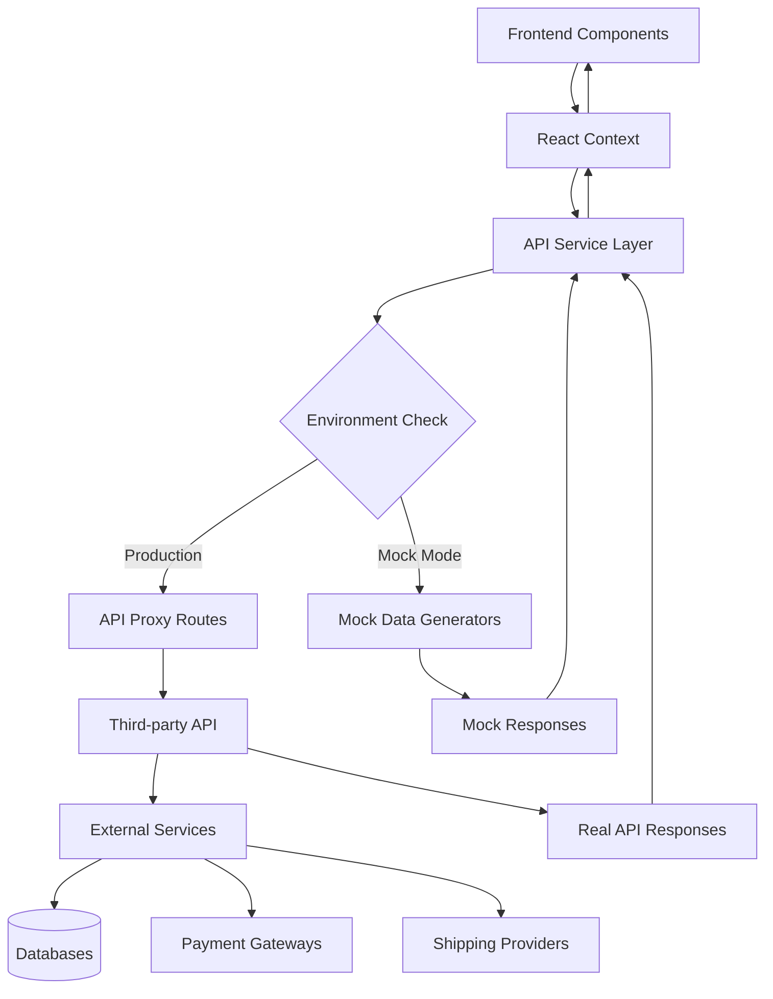

## Order Management Flow

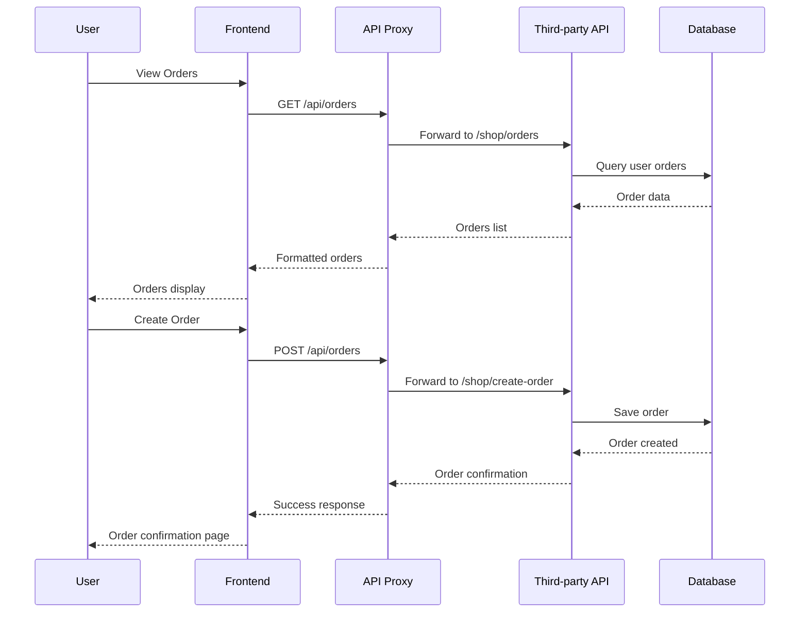

## Product Search and Filtering Flow

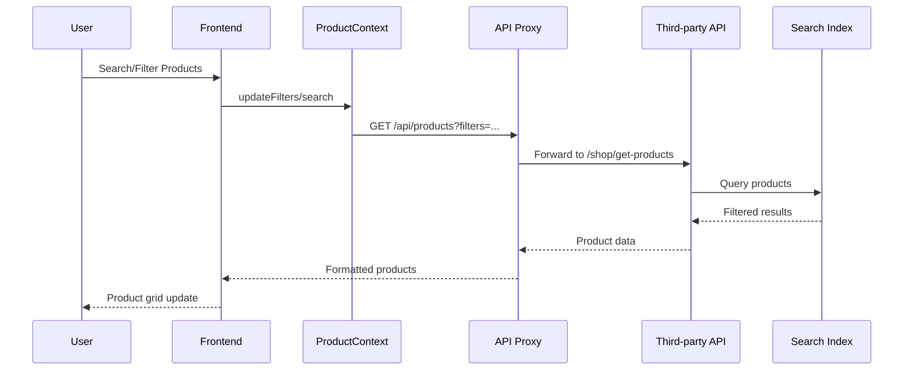

## Error Handling and Fallback Flow

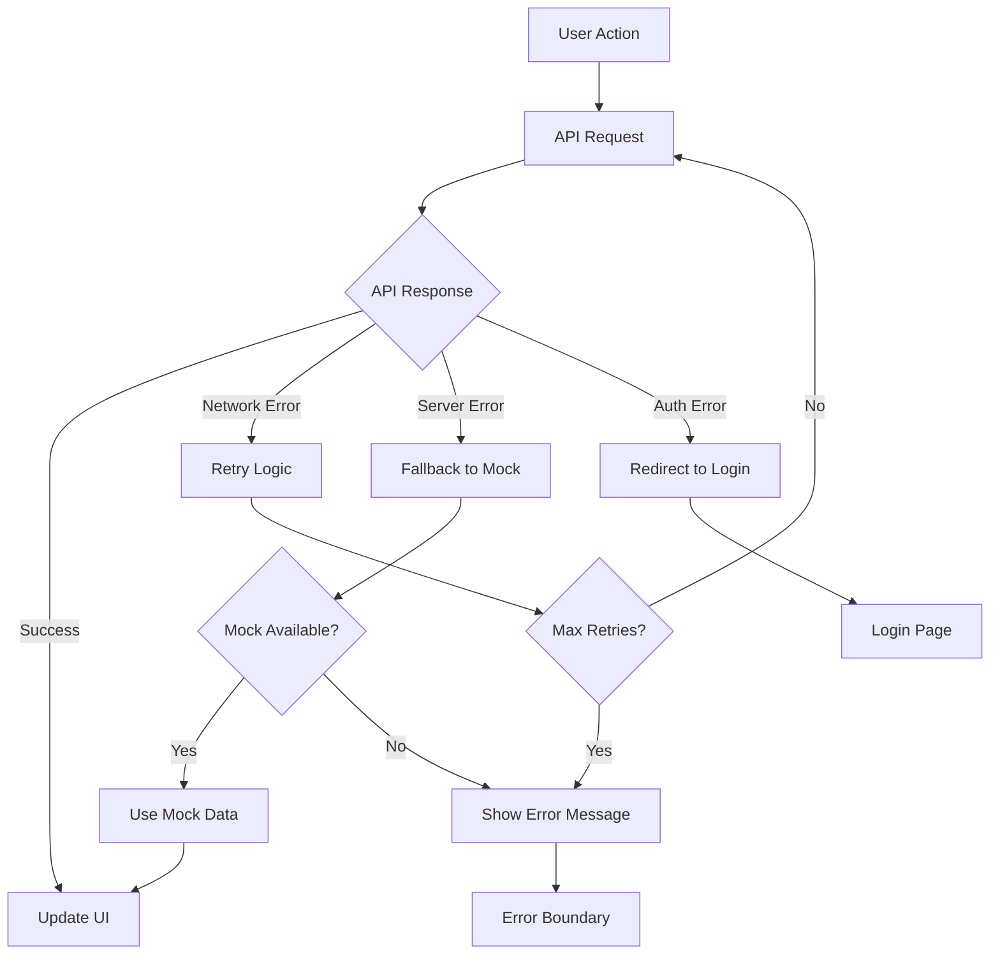

## Third-party Data Storage Integration

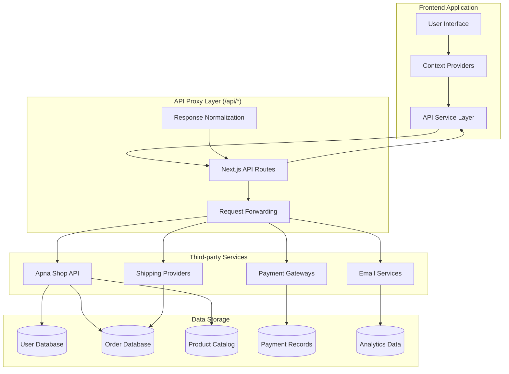

## Performance Monitoring Flow

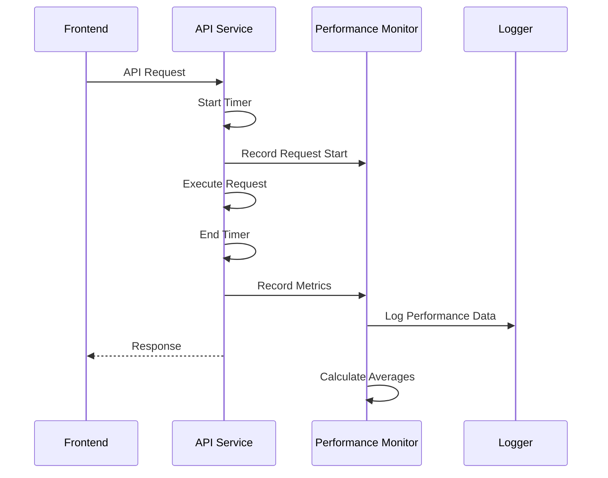

## Security Flow

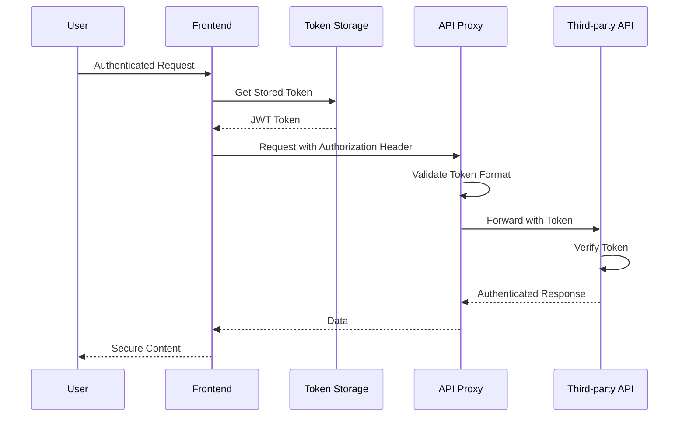

## Caching Strategy Flow

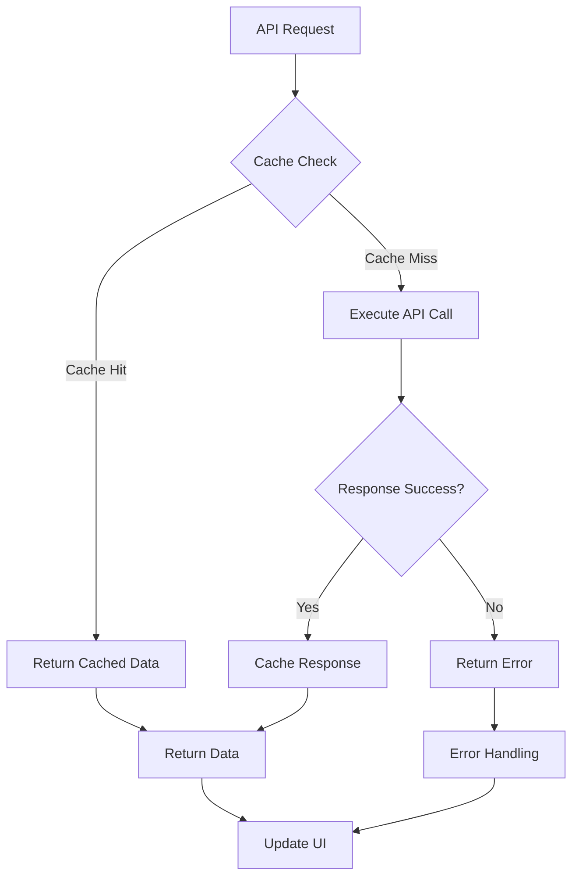

This documentation provides a comprehensive overview of the application's module flows, ensuring developers understand the data flow, error handling, and integration patterns throughout the system.

## Developer Onboarding Guide

### Getting Started

1. **Environment Setup**

   - Clone the repository and install dependencies with `npm install`
   - Copy `.env.example` to `.env` and configure API credentials
   - Run `npm run dev` to start the development server

2. **Understanding the Architecture**

   - Review the atomic design component structure in `src/components/`
   - Familiarize yourself with the service layer in `src/lib/`
   - Study the context providers in `src/contexts/`

3. **Key Concepts**
   - **ApiService**: Centralized API client with caching and monitoring
   - **Context Providers**: State management for auth, cart, products
   - **Atomic Design**: Component hierarchy (atoms → molecules → organisms)
   - **API Proxy**: Local `/api/*` routes proxy third-party API calls

### Development Workflow

1. **Feature Development**

   - Create components following atomic design principles
   - Use existing context providers for state management
   - Add API calls through ApiService methods
   - Test with mock data using `NEXT_PUBLIC_USE_MOCK=true`

2. **Code Organization**
   - Place reusable components in appropriate atomic folders
   - Add custom hooks in `src/hooks/`
   - Extend API services in `src/lib/`
   - Update context providers for new state needs

## Common Pitfalls and Solutions

### API Integration Issues

- **CORS Errors**: Always use local `/api/*` routes instead of direct third-party API calls
- **Authentication Failures**: Ensure `X-Tenant` header is set in API requests
- **Token Expiration**: Implement proper token refresh logic in AuthService

### State Management Problems

- **Context Not Updating**: Use proper dependency arrays in useEffect hooks
- **Race Conditions**: Implement optimistic updates with proper rollback
- **Memory Leaks**: Clean up subscriptions and timeouts in useEffect

### Component Architecture Issues

- **Prop Drilling**: Use context providers instead of passing props deeply
- **Re-rendering Issues**: Memoize expensive computations and callbacks
- **Accessibility**: Always include proper ARIA labels and semantic HTML

### Performance Bottlenecks

- **Large Bundle Size**: Lazy load components and use dynamic imports
- **API Call Frequency**: Implement caching and request deduplication
- **Image Loading**: Use Next.js Image component with proper sizing

## Testing Guidelines

### Unit Testing

- **Component Testing**: Test component rendering and user interactions
- **Hook Testing**: Test custom hooks with React Testing Library
- **Service Testing**: Mock API calls and test service methods
- **Utility Testing**: Test validation and calculation functions

### Integration Testing

- **API Integration**: Test complete API flows with mock responses
- **Context Integration**: Test context providers with real components
- **End-to-End Flows**: Test complete user journeys

### Testing Best Practices

- **Mock Data**: Use comprehensive mock data for consistent testing
- **Test Isolation**: Avoid test interdependencies
- **Accessibility Testing**: Include a11y checks in component tests
- **Performance Testing**: Monitor bundle size and runtime performance

### Test File Organization

```
src/
├── __tests__/                    # Test files
│   ├── components/              # Component tests
│   ├── hooks/                   # Hook tests
│   ├── lib/                     # Service tests
│   └── utils/                   # Utility tests
├── __mocks__/                   # Mock implementations
└── test-utils/                  # Testing utilities
```

## Scalability Considerations

### Performance Optimization

- **Code Splitting**: Use dynamic imports for route-based splitting
- **Image Optimization**: Implement responsive images with WebP format
- **Caching Strategy**: Multi-layer caching (memory, localStorage, HTTP)
- **Bundle Analysis**: Monitor bundle size with webpack-bundle-analyzer

### Architecture Scalability

- **Modular Services**: Keep services focused on single responsibilities
- **Context Splitting**: Split large contexts into smaller, focused providers
- **Component Libraries**: Extract reusable components into separate packages
- **API Rate Limiting**: Implement client-side rate limiting for API calls

### Database and API Considerations

- **Request Batching**: Combine multiple API calls when possible
- **Response Compression**: Enable gzip compression for API responses
- **Pagination**: Implement proper pagination for large datasets
- **Real-time Updates**: Consider WebSocket integration for live data

### Monitoring and Analytics

- **Error Tracking**: Implement error boundaries and logging
- **Performance Monitoring**: Track API response times and user interactions
- **User Analytics**: Monitor user behavior and conversion funnels
- **A/B Testing**: Framework for testing UI/UX variations

## Error Handling Best Practices

### Client-Side Error Handling

- **Network Errors**: Implement retry logic with exponential backoff
- **Validation Errors**: Provide clear, actionable error messages
- **Authentication Errors**: Handle token expiration gracefully
- **Offline Mode**: Provide offline functionality with local storage

### Server-Side Error Handling

- **API Errors**: Normalize error responses across different APIs
- **Timeout Handling**: Implement proper request timeouts
- **Rate Limiting**: Handle API rate limits with backoff strategies
- **Fallback Data**: Provide fallback UI states for failed requests

### Error Recovery

- **Automatic Retry**: Implement smart retry logic for transient failures
- **User Feedback**: Show clear error messages with recovery options
- **Graceful Degradation**: Maintain functionality when non-critical features fail
- **Error Boundaries**: Prevent cascading failures in component trees

## Security Considerations

### Authentication Security

- **Token Storage**: Use HttpOnly cookies for sensitive tokens
- **Session Management**: Implement proper session timeout and renewal
- **CSRF Protection**: Include CSRF tokens in state-changing requests
- **Password Policies**: Enforce strong password requirements

### API Security

- **Request Validation**: Validate all input data on client and server
- **Rate Limiting**: Implement client-side rate limiting
- **HTTPS Only**: Ensure all API calls use HTTPS in production
- **Header Security**: Sanitize and validate request headers

### Data Protection

- **Input Sanitization**: Sanitize user inputs to prevent XSS attacks
- **Data Encryption**: Encrypt sensitive data in local storage
- **Privacy Compliance**: Implement GDPR and privacy regulations
- **Audit Logging**: Log security-relevant events

## Testing Guidelines

### Testing Environment Setup

The application supports two testing modes:

- **Mock Mode** (`NEXT_PUBLIC_USE_MOCK=true`): Uses local mock data for development and testing
- **Live Mode** (`NEXT_PUBLIC_USE_MOCK=false`): Connects to live Apna Shop APIs

### Available Test Scripts

#### For Live API Testing (when server is available):

```bash
# Switch to live mode
echo "NEXT_PUBLIC_USE_MOCK=false" > .env

# Run live API tests
node test-live-api.js
```

#### For Application Component Testing:

```bash
# Run comprehensive component tests
node test-application-components.js

# Test running Next.js application
node test-nextjs-app.js
```

### Test Coverage

- **API Integration**: Tests all Apna Shop APIs endpoints
- **Service Layer**: Validates ApiService and AuthService functionality
- **Context Providers**: Tests CartProvider, ProductProvider, and AuthProvider
- **Component Structure**: Verifies atomic design implementation
- **Error Handling**: Tests fallback mechanisms and error recovery
- **Performance**: Monitors API response times and caching effectiveness

### Testing Best Practices

- **Mock First**: Use mock mode for development and unit testing
- **Integration Testing**: Test complete user flows with live data when available
- **Error Scenarios**: Test network failures, API errors, and edge cases
- **Performance Monitoring**: Track API performance and caching effectiveness
- **Accessibility**: Include a11y testing in component validation

## Deployment and DevOps

### Environment Management

- **Environment Variables**: Use different configs for dev/staging/production
- **Feature Flags**: Implement feature toggles for gradual rollouts
- **Configuration Management**: Centralize configuration in environment files
- **Secret Management**: Securely store API keys and secrets

### CI/CD Pipeline

- **Automated Testing**: Run tests on every push and PR
- **Code Quality**: Implement linting and formatting checks
- **Security Scanning**: Regular security vulnerability scans
- **Performance Monitoring**: Track performance regressions

### Monitoring and Alerting

- **Application Monitoring**: Track application health and errors
- **User Monitoring**: Monitor user experience and satisfaction
- **Business Metrics**: Track conversion rates and user engagement
- **Infrastructure Monitoring**: Monitor server and database performance
