# Module Flows Documentation

This document outlines the key module flows in the eCommerce application, including authentication, cart management, checkout process, payment integrations, and API interactions.

## Authentication Flow

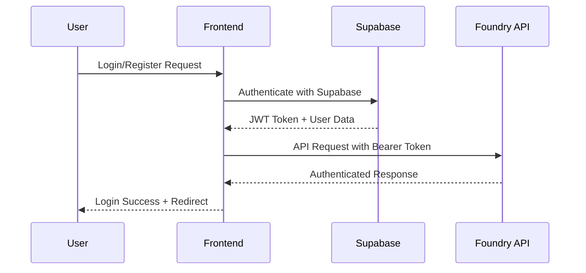

## Cart Management Flow

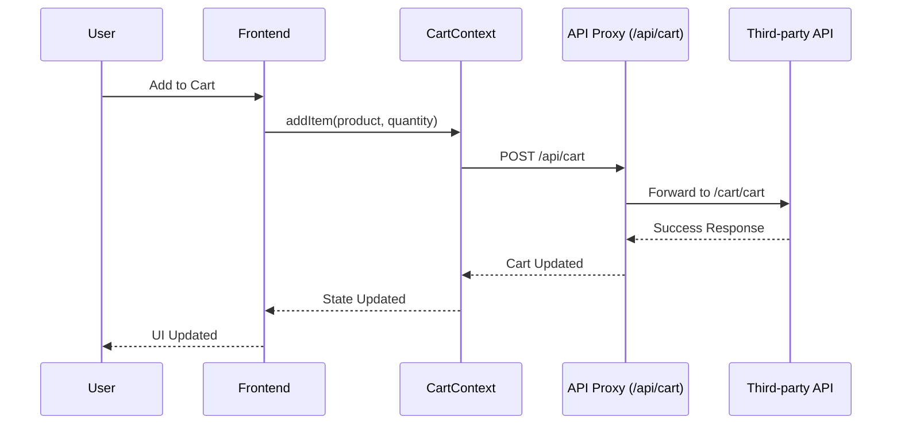

## Wishlist Management Flow

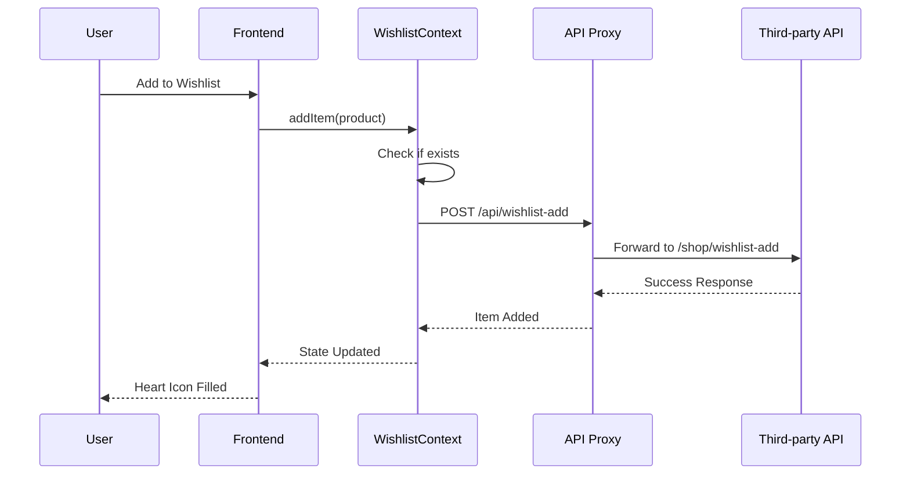

## Checkout Process Flow

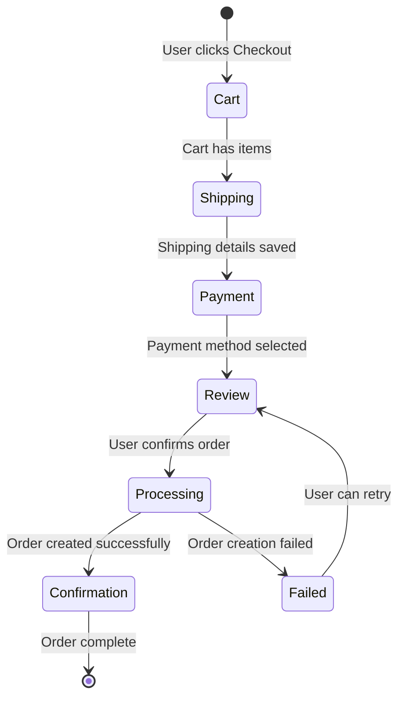

## Payment Integration Flows

### Razorpay Payment Flow

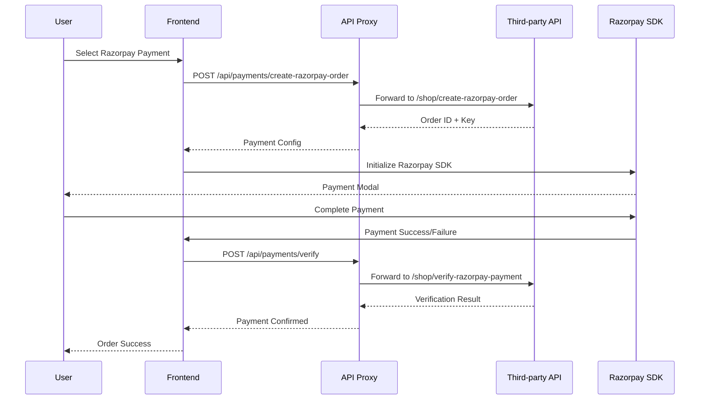

### Stripe Payment Flow

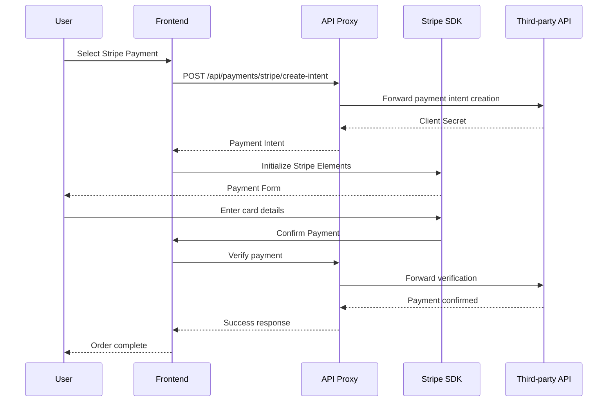

### PayPal Payment Flow

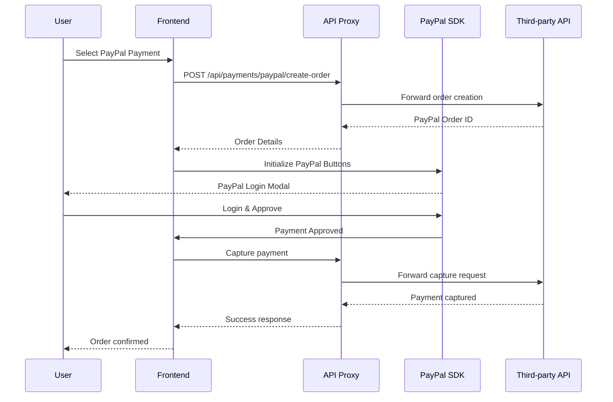

## API Data Flow Architecture

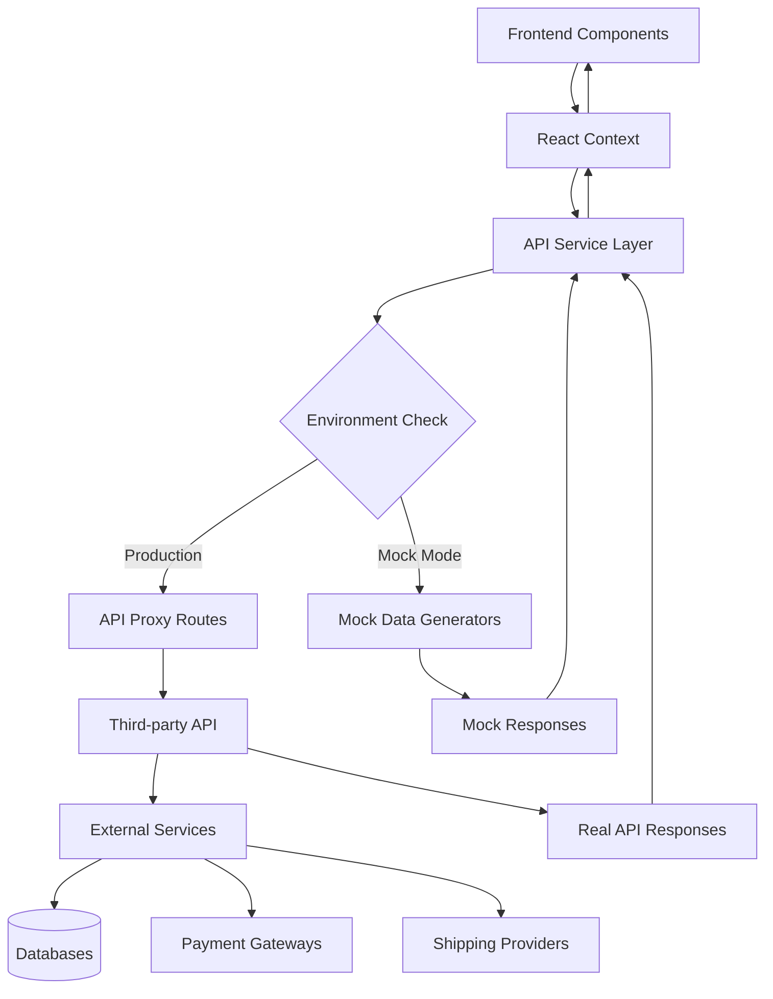

## Order Management Flow

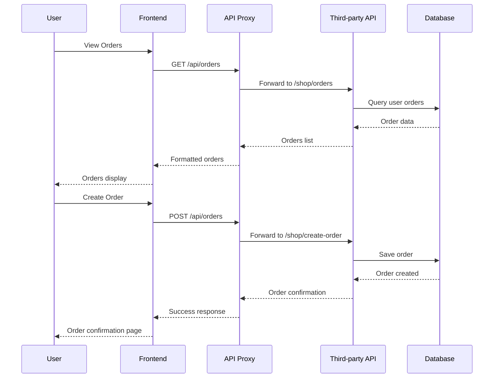

## Product Search and Filtering Flow

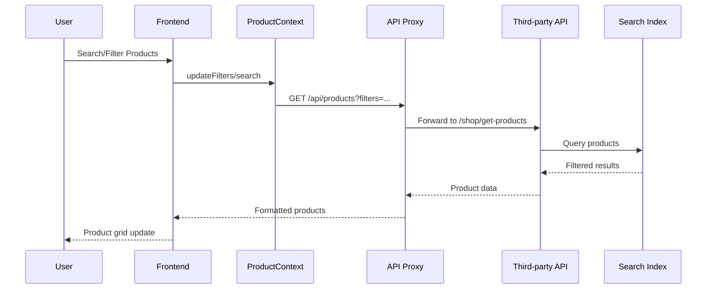

## Error Handling and Fallback Flow

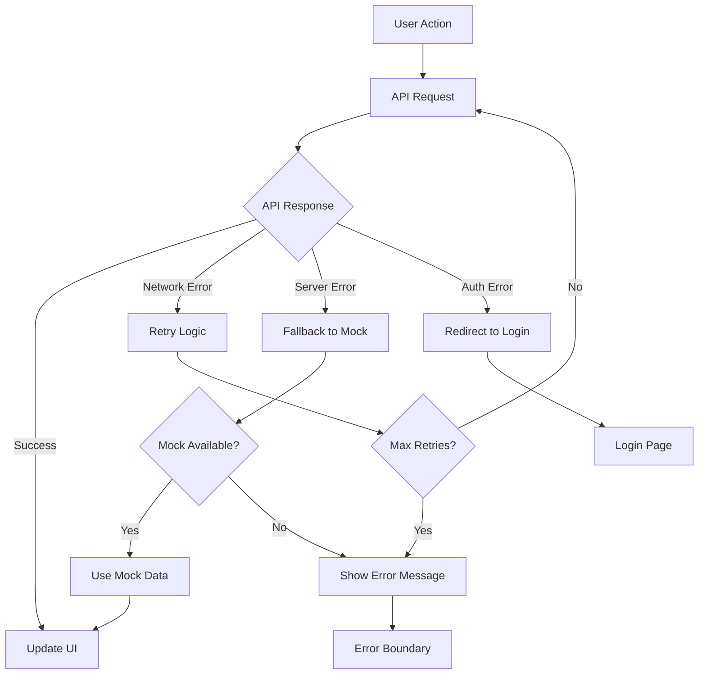

## Third-party Data Storage Integration

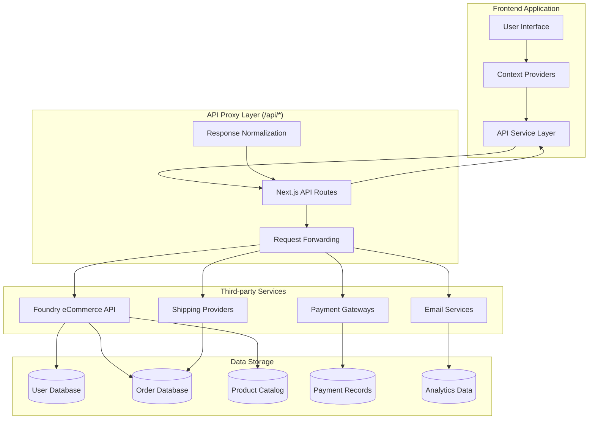

## Performance Monitoring Flow

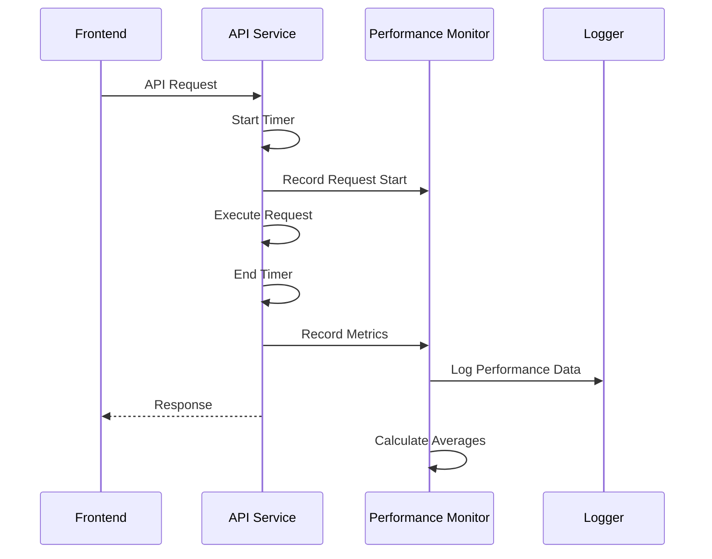

## Security Flow

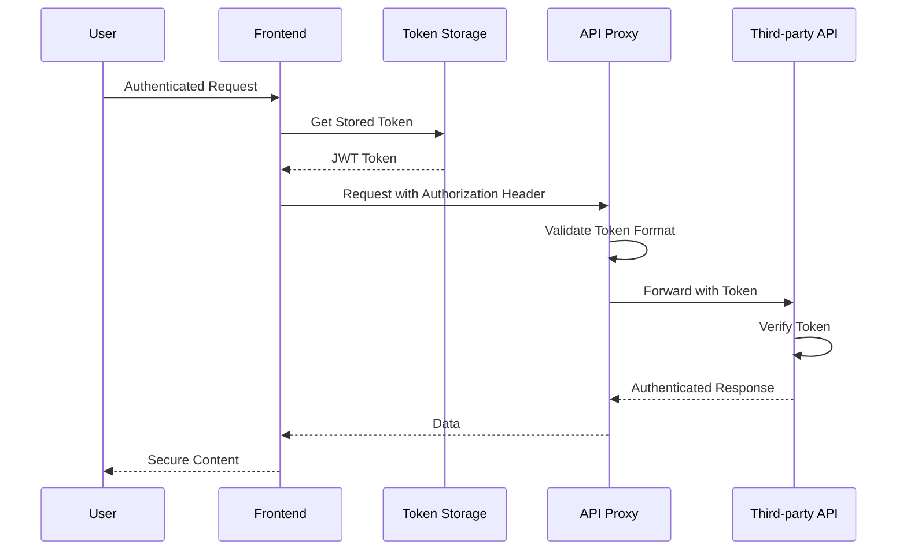

## Caching Strategy Flow

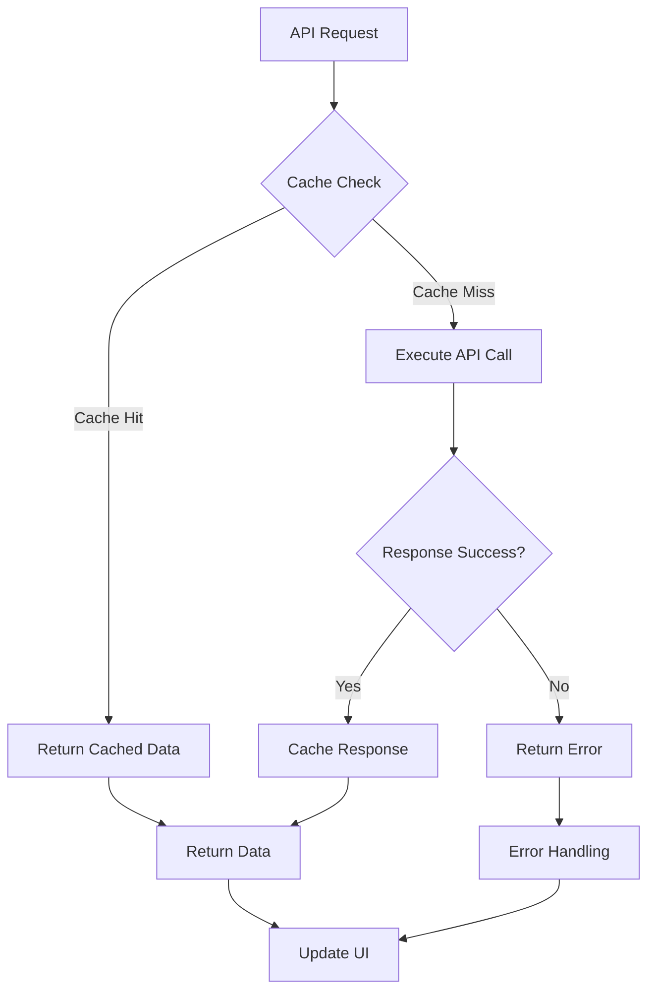

This documentation provides a comprehensive overview of the application's module flows, ensuring developers understand the data flow, error handling, and integration patterns throughout the system.
